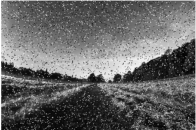
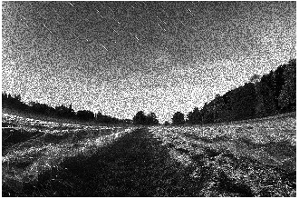

# YODA PROJECT (Your Own Digital Accerlerator)

 This is the Formal Git Repository for the YODA Project

 # Tools

 

  
  
  

## Median Filter:

The median filter is a non-linear digital filtering technique, often used to remove noise from an image or signal. Such noise reduction is a typical pre-processing step to improve the results of later processing (for example, edge detection on an image). Median filtering is very widely used in digital image processing because, under certain conditions, it preserves edges while removing noise (but see the discussion below), also having applications in signal processing.

To demonstrate, using a window size of three with one entry immediately preceding and following each entry, a median filter will be applied to the following simple one-dimensional signal:

x = (2, 3, 80, 6, 2, 3).  
So, the median filtered output signal y will be:  

y1 = med(2, 3, 80) = 3, (already 2, 3, and 80 are in the increasing order so no need to arrange them)  
y2 = med(3, 80, 6) = med(3, 6, 80) = 6, (3, 80, and 6 are rearranged to find the median)  
y3 = med(80, 6, 2) = med(2, 6, 80) = 6,  
y4 = med(6, 2, 3) = med(2, 3, 6) = 3,  
i.e. y = (3, 6, 6, 3)  

### Added Noise unsing Matlab:

#### Salt annd Peper Noise 

#### Speckle Noise

#### Noisy Image :

#### Denoise Image :

#### Edge Detection:Sobel Filter

Edge detection includes a variety of mathematical methods that aim at identifying edges, curves in a digital image at which the image brightness changes sharply or, more formally, has discontinuities.
Sobel Edge detection is a widely used algorithm of edge detection in image processing. Along with Canny and Prewitt, Sobel is one of the most popular edge detection algorithms used in today's technology.

### The Math Behind the Sobel Algorithm
When using Sobel Edge Detection, the image is processed in the X and Y directions separately first, and then combined together to form a new image which represents the sum of the X and Y edges of the image. However, these images can be processed separately as well. This will be covered later in this document.

When using a Sobel Edge Detector, it is first best to convert the image from an RGB scale to a Grayscale image. Then from there, we will use what is called kernel convolution. A kernel is a 3 x 3 matrix consisting of differently (or symmetrically) weighted indexes. This will represent the filter that we will be implementing for an edge detection.

When we want to scan across the X direction of an image for example, we will want to use the following X Direction Kernel to scan for large changes in the gradient. Similarly, when we want to scan across the Y direction of an image, we could also use the following Y Direction Kernel to scan for large gradients as well.

#### Orginal Image

#### Atter Sobel Filter

